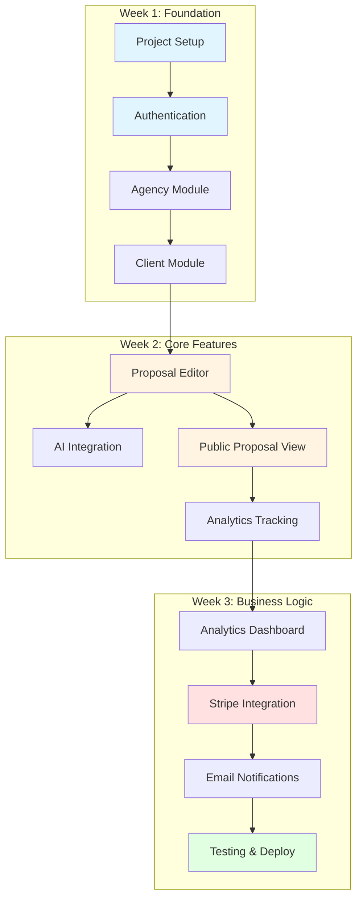
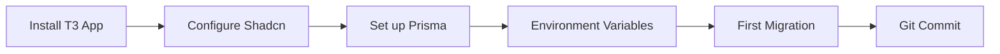
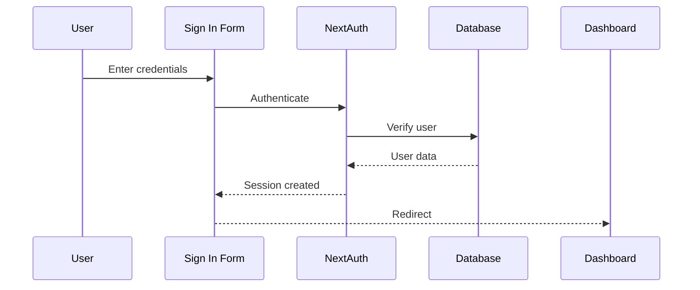
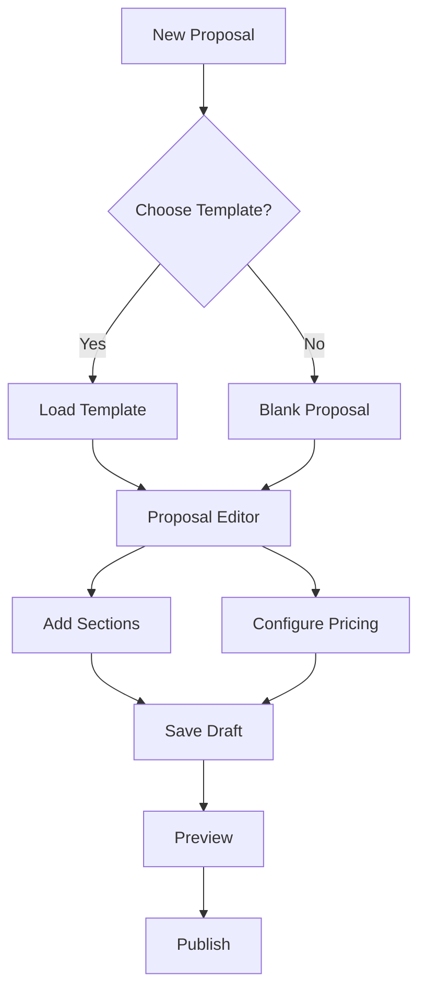
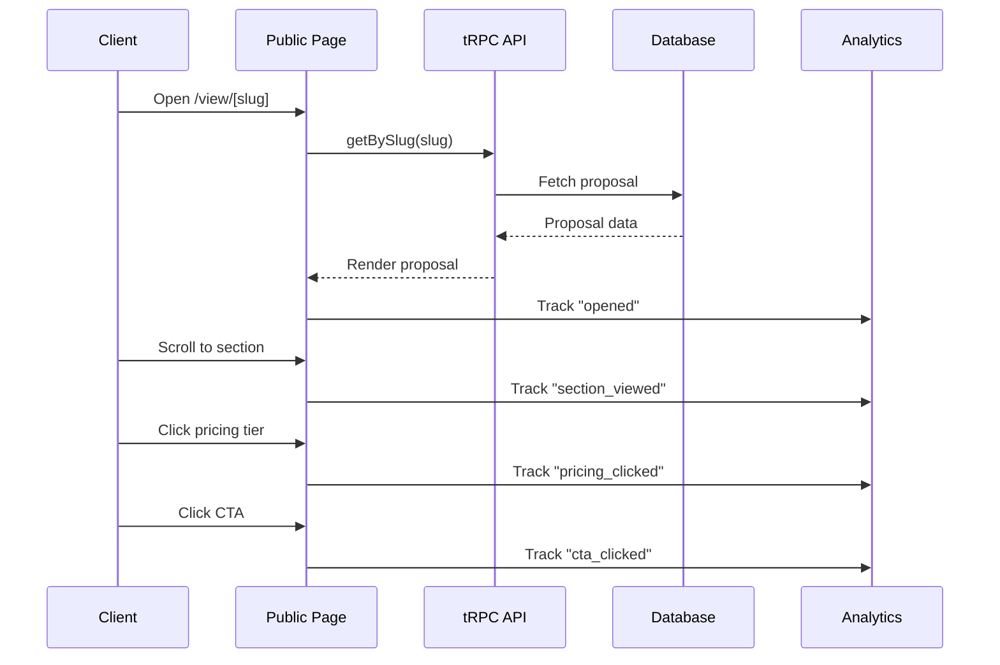
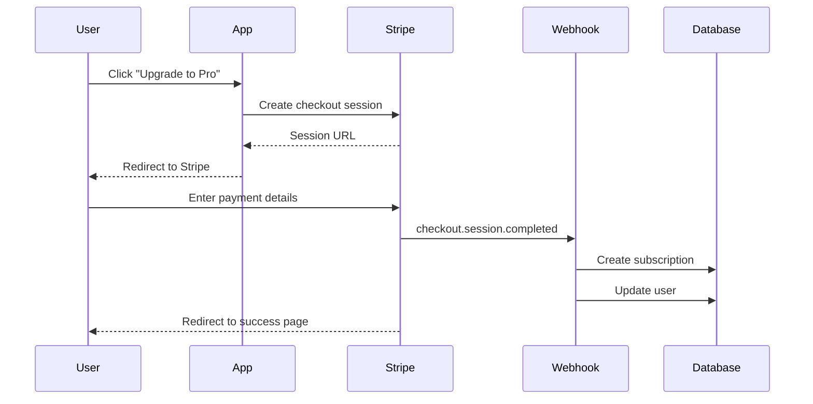
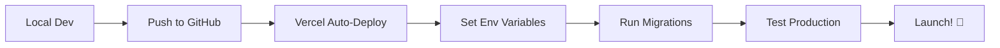

# SendVelo - Implementation Plan & Execution Guide

## Quick Reference

- **Timeline:** 3 weeks to MVP
- **Tech Stack:** Next.js 14 + tRPC + Prisma + Shadcn/ui + Stripe + AI SDK
- **Deployment:** Vercel + Neon PostgreSQL
- **Team Size:** 1-2 developers
- **Methodology:** Feature-driven, incremental deployment

---

## Module Dependency Graph



---

## Week 1: Foundation (Days 1-5)

### Day 1: Project Initialization



**Tasks:**

1. **Initialize T3 App**
```bash
pnpm create t3-app@latest sendvelo
# Selections:
# - TypeScript: Yes
# - tRPC: Yes
# - Prisma: Yes
# - NextAuth: Yes
# - Tailwind: Yes
# - Git: Yes
# - App Router: Yes
# - Import alias: @/*
```

2. **Install Shadcn/ui**
```bash
cd sendvelo
pnpm dlx shadcn@latest init

# Config selections:
# - Style: Default
# - Base color: Zinc
# - CSS variables: Yes

# Install initial components
pnpm dlx shadcn@latest add button input form label textarea select card dialog dropdown-menu toast tabs accordion separator avatar checkbox popover
```

3. **Install Additional Dependencies**
```bash
# AI
pnpm add ai @ai-sdk/openai @ai-sdk/anthropic

# Payments
pnpm add stripe @stripe/stripe-js @stripe/react-stripe-js

# Email
pnpm add postmark react-email @react-email/components

# Analytics
pnpm add posthog-js posthog-node

# Utilities
pnpm add date-fns sonner recharts lucide-react

# Dev dependencies
pnpm add -D @types/bcryptjs
```

4. **Configure Prisma Schema**
- Copy schema from `TECHNICAL_ARCHITECTURE.md`
- Update `prisma/schema.prisma`

5. **Environment Setup**
- Copy `.env.example` to `.env`
- Fill in database URL (local Postgres or Neon)
- Generate NextAuth secret: `openssl rand -base64 32`

6. **Run First Migration**
```bash
pnpm prisma migrate dev --name init
pnpm prisma generate
```

**Checkpoint:** ✅ Project compiles, database migrated, dev server runs

---

### Day 2: Authentication Setup



**Tasks:**

1. **Configure NextAuth**

File: `lib/auth/options.ts`
```typescript
import { PrismaAdapter } from "@auth/prisma-adapter"
import { type DefaultSession, type NextAuthOptions } from "next-auth"
import CredentialsProvider from "next-auth/providers/credentials"
import GoogleProvider from "next-auth/providers/google"
import bcrypt from "bcryptjs"
import { prisma } from "@/lib/prisma"

declare module "next-auth" {
  interface Session extends DefaultSession {
    user: {
      id: string
      role: "USER" | "ADMIN"
    } & DefaultSession["user"]
  }
}

export const authOptions: NextAuthOptions = {
  adapter: PrismaAdapter(prisma),
  session: { strategy: "jwt" },
  pages: {
    signIn: "/signin",
  },
  providers: [
    CredentialsProvider({
      credentials: {
        email: { label: "Email", type: "email" },
        password: { label: "Password", type: "password" },
      },
      async authorize(credentials) {
        if (!credentials?.email || !credentials?.password) {
          return null
        }

        const user = await prisma.user.findUnique({
          where: { email: credentials.email },
        })

        if (!user || !user.password) {
          return null
        }

        const isValid = await bcrypt.compare(credentials.password, user.password)

        if (!isValid) {
          return null
        }

        return {
          id: user.id,
          email: user.email,
          name: user.name,
          role: user.role,
        }
      },
    }),
    GoogleProvider({
      clientId: process.env.GOOGLE_CLIENT_ID!,
      clientSecret: process.env.GOOGLE_CLIENT_SECRET!,
    }),
  ],
  callbacks: {
    jwt: async ({ token, user }) => {
      if (user) {
        token.id = user.id
        token.role = user.role
      }
      return token
    },
    session: async ({ session, token }) => {
      if (session.user) {
        session.user.id = token.id as string
        session.user.role = token.role as "USER" | "ADMIN"
      }
      return session
    },
  },
}
```

2. **Create Auth Pages**

File: `app/(auth)/signin/page.tsx`
```typescript
import { SignInForm } from "@/components/auth/SignInForm"

export default function SignInPage() {
  return (
    <div className="container flex h-screen w-screen flex-col items-center justify-center">
      <div className="mx-auto flex w-full flex-col justify-center space-y-6 sm:w-[350px]">
        <div className="flex flex-col space-y-2 text-center">
          <h1 className="text-2xl font-semibold tracking-tight">
            Welcome back
          </h1>
          <p className="text-sm text-muted-foreground">
            Sign in to your account
          </p>
        </div>
        <SignInForm />
      </div>
    </div>
  )
}
```

3. **Build Sign In Component**

File: `components/auth/SignInForm.tsx`
```typescript
"use client"

import { useState } from "react"
import { signIn } from "next-auth/react"
import { useRouter } from "next/navigation"
import { zodResolver } from "@hookform/resolvers/zod"
import { useForm } from "react-hook-form"
import * as z from "zod"

import { Button } from "@/components/ui/button"
import { Input } from "@/components/ui/input"
import { Label } from "@/components/ui/label"
import { toast } from "sonner"

const schema = z.object({
  email: z.string().email(),
  password: z.string().min(8),
})

type FormData = z.infer<typeof schema>

export function SignInForm() {
  const router = useRouter()
  const [isLoading, setIsLoading] = useState(false)

  const {
    register,
    handleSubmit,
    formState: { errors },
  } = useForm<FormData>({
    resolver: zodResolver(schema),
  })

  const onSubmit = async (data: FormData) => {
    setIsLoading(true)

    const result = await signIn("credentials", {
      email: data.email,
      password: data.password,
      redirect: false,
    })

    setIsLoading(false)

    if (result?.error) {
      toast.error("Invalid credentials")
    } else {
      router.push("/dashboard")
      router.refresh()
    }
  }

  return (
    <form onSubmit={handleSubmit(onSubmit)} className="space-y-4">
      <div className="space-y-2">
        <Label htmlFor="email">Email</Label>
        <Input
          id="email"
          type="email"
          placeholder="name@example.com"
          {...register("email")}
        />
        {errors.email && (
          <p className="text-sm text-red-500">{errors.email.message}</p>
        )}
      </div>

      <div className="space-y-2">
        <Label htmlFor="password">Password</Label>
        <Input
          id="password"
          type="password"
          {...register("password")}
        />
        {errors.password && (
          <p className="text-sm text-red-500">{errors.password.message}</p>
        )}
      </div>

      <Button type="submit" className="w-full" disabled={isLoading}>
        {isLoading ? "Signing in..." : "Sign in"}
      </Button>
    </form>
  )
}
```

4. **Create Middleware for Protected Routes**

File: `middleware.ts`
```typescript
export { default } from "next-auth/middleware"

export const config = {
  matcher: ["/dashboard/:path*", "/onboarding/:path*"],
}
```

**Checkpoint:** ✅ Users can sign up, sign in, and access protected routes

---

### Day 3: Agency Profile Module

**Database Tables:** `Agency`, `Service`, `BrandVoice`, `PricingPreset`

**Tasks:**

1. **Create tRPC Router**

File: `server/routers/agency.ts`
```typescript
import { z } from "zod"
import { router, protectedProcedure } from "../trpc"
import { TRPCError } from "@trpc/server"

export const agencyRouter = router({
  get: protectedProcedure.query(async ({ ctx }) => {
    const agency = await ctx.prisma.agency.findUnique({
      where: { userId: ctx.session.user.id },
      include: {
        services: { orderBy: { sortOrder: "asc" } },
        pricingPresets: {
          include: { deliverables: true },
          orderBy: { sortOrder: "asc" },
        },
        brandVoice: true,
      },
    })

    return agency
  }),

  create: protectedProcedure
    .input(
      z.object({
        name: z.string().min(1).max(100),
        website: z.string().url().optional(),
        description: z.string().optional(),
      })
    )
    .mutation(async ({ ctx, input }) => {
      // Check if agency already exists
      const existing = await ctx.prisma.agency.findUnique({
        where: { userId: ctx.session.user.id },
      })

      if (existing) {
        throw new TRPCError({
          code: "BAD_REQUEST",
          message: "Agency already exists",
        })
      }

      return ctx.prisma.agency.create({
        data: {
          userId: ctx.session.user.id,
          ...input,
        },
      })
    }),

  update: protectedProcedure
    .input(
      z.object({
        name: z.string().min(1).max(100).optional(),
        website: z.string().url().optional(),
        logo: z.string().url().optional(),
        description: z.string().optional(),
      })
    )
    .mutation(async ({ ctx, input }) => {
      return ctx.prisma.agency.update({
        where: { userId: ctx.session.user.id },
        data: input,
      })
    }),

  addService: protectedProcedure
    .input(
      z.object({
        name: z.string(),
        description: z.string(),
        category: z.string().optional(),
      })
    )
    .mutation(async ({ ctx, input }) => {
      const agency = await ctx.prisma.agency.findUnique({
        where: { userId: ctx.session.user.id },
      })

      if (!agency) {
        throw new TRPCError({
          code: "NOT_FOUND",
          message: "Agency not found",
        })
      }

      return ctx.prisma.service.create({
        data: {
          agencyId: agency.id,
          ...input,
        },
      })
    }),

  updateService: protectedProcedure
    .input(
      z.object({
        id: z.string().cuid(),
        name: z.string().optional(),
        description: z.string().optional(),
      })
    )
    .mutation(async ({ ctx, input }) => {
      const { id, ...data } = input
      return ctx.prisma.service.update({
        where: { id },
        data,
      })
    }),

  deleteService: protectedProcedure
    .input(z.object({ id: z.string().cuid() }))
    .mutation(async ({ ctx, input }) => {
      return ctx.prisma.service.delete({
        where: { id: input.id },
      })
    }),
})
```

2. **Build Agency Settings Page**

File: `app/(dashboard)/agency/page.tsx`
```typescript
import { redirect } from "next/navigation"
import { getServerAuthSession } from "@/lib/auth/session"
import { AgencyProfile } from "@/components/agency/AgencyProfile"

export default async function AgencyPage() {
  const session = await getServerAuthSession()

  if (!session) {
    redirect("/signin")
  }

  return (
    <div className="container py-8">
      <div className="space-y-6">
        <div>
          <h1 className="text-3xl font-bold">Agency Profile</h1>
          <p className="text-muted-foreground">
            Manage your agency information and services
          </p>
        </div>
        <AgencyProfile />
      </div>
    </div>
  )
}
```

3. **Build Agency Components**
- `components/agency/AgencyProfile.tsx` - Main profile display/edit
- `components/agency/ServiceList.tsx` - List and manage services
- `components/agency/PricingTierBuilder.tsx` - Pricing presets

**Checkpoint:** ✅ Users can create and manage agency profiles

---

### Day 4: Client Management Module

**Database Table:** `Client`

**Tasks:**

1. **Create tRPC Router**

File: `server/routers/client.ts`
```typescript
import { z } from "zod"
import { router, protectedProcedure } from "../trpc"

export const clientRouter = router({
  list: protectedProcedure.query(async ({ ctx }) => {
    return ctx.prisma.client.findMany({
      orderBy: { createdAt: "desc" },
    })
  }),

  create: protectedProcedure
    .input(
      z.object({
        name: z.string().min(1),
        email: z.string().email().optional(),
        website: z.string().url().optional(),
        industry: z.string().optional(),
        description: z.string().optional(),
      })
    )
    .mutation(async ({ ctx, input }) => {
      return ctx.prisma.client.create({
        data: input,
      })
    }),

  update: protectedProcedure
    .input(
      z.object({
        id: z.string().cuid(),
        name: z.string().optional(),
        email: z.string().email().optional(),
        website: z.string().url().optional(),
        industry: z.string().optional(),
        description: z.string().optional(),
      })
    )
    .mutation(async ({ ctx, input }) => {
      const { id, ...data } = input
      return ctx.prisma.client.update({
        where: { id },
        data,
      })
    }),

  delete: protectedProcedure
    .input(z.object({ id: z.string().cuid() }))
    .mutation(async ({ ctx, input }) => {
      return ctx.prisma.client.delete({
        where: { id: input.id },
      })
    }),
})
```

2. **Build Client Pages**
- `app/(dashboard)/clients/page.tsx` - Client list
- `components/clients/ClientList.tsx` - Table/grid view
- `components/clients/ClientForm.tsx` - Add/edit form
- `components/clients/ClientCard.tsx` - Display component

**Checkpoint:** ✅ Users can manage clients

---

### Day 5: Onboarding Flow

**Tasks:**

1. **Create Onboarding Wizard**

File: `app/onboarding/page.tsx`
```typescript
"use client"

import { useState } from "react"
import { useRouter } from "next/navigation"
import { OnboardingStep1 } from "@/components/onboarding/Step1AgencyInfo"
import { OnboardingStep2 } from "@/components/onboarding/Step2Services"
import { OnboardingStep3 } from "@/components/onboarding/Step3Complete"

export default function OnboardingPage() {
  const router = useRouter()
  const [step, setStep] = useState(1)

  const handleComplete = () => {
    router.push("/dashboard")
  }

  return (
    <div className="container max-w-2xl py-12">
      <div className="space-y-8">
        {/* Progress indicator */}
        <div className="flex items-center justify-between">
          <div className={`step ${step >= 1 ? "active" : ""}`}>1. Agency</div>
          <div className={`step ${step >= 2 ? "active" : ""}`}>2. Services</div>
          <div className={`step ${step >= 3 ? "active" : ""}`}>3. Done</div>
        </div>

        {/* Step content */}
        {step === 1 && <OnboardingStep1 onNext={() => setStep(2)} />}
        {step === 2 && <OnboardingStep2 onNext={() => setStep(3)} />}
        {step === 3 && <OnboardingStep3 onComplete={handleComplete} />}
      </div>
    </div>
  )
}
```

2. **Build Step Components**
- Create multi-step wizard components
- Validate each step before proceeding
- Save data progressively

**Checkpoint:** ✅ New users complete onboarding → Dashboard

---

## Week 2: Core Features (Days 6-10)

### Day 6-7: Proposal Creation Module



**Tasks:**

1. **Create tRPC Router**

File: `server/routers/proposal.ts` (see TECHNICAL_ARCHITECTURE.md for full code)

2. **Build Proposal Editor**

File: `app/(dashboard)/proposals/[id]/edit/page.tsx`
```typescript
import { ProposalEditor } from "@/components/proposals/ProposalEditor"
import { getServerAuthSession } from "@/lib/auth/session"
import { api } from "@/trpc/server"
import { redirect } from "next/navigation"

export default async function EditProposalPage({
  params,
}: {
  params: { id: string }
}) {
  const session = await getServerAuthSession()
  if (!session) redirect("/signin")

  const proposal = await api.proposal.get({ id: params.id })

  return <ProposalEditor proposal={proposal} />
}
```

3. **Build Rich Text Editor Component**

Choose one:
- **Tiptap** (recommended) - Modern, extensible
- **Lexical** - Facebook's editor
- **Slate** - Lightweight

Install Tiptap:
```bash
pnpm add @tiptap/react @tiptap/starter-kit @tiptap/extension-placeholder
```

File: `components/proposals/RichTextEditor.tsx`
```typescript
"use client"

import { useEditor, EditorContent } from "@tiptap/react"
import StarterKit from "@tiptap/starter-kit"
import Placeholder from "@tiptap/extension-placeholder"

export function RichTextEditor({
  content,
  onChange,
}: {
  content: string
  onChange: (content: string) => void
}) {
  const editor = useEditor({
    extensions: [
      StarterKit,
      Placeholder.configure({
        placeholder: "Start writing...",
      }),
    ],
    content,
    onUpdate: ({ editor }) => {
      onChange(editor.getHTML())
    },
  })

  return (
    <div className="border rounded-lg p-4">
      <EditorContent editor={editor} />
    </div>
  )
}
```

4. **Build Section Management**
- Add/remove sections
- Drag-and-drop reordering (react-beautiful-dnd or dnd-kit)
- Save automatically (debounced)

5. **Build Pricing Editor**
- 3-tier pricing table builder
- Add/remove deliverables per tier
- Price input fields

**Checkpoint:** ✅ Users can create and edit proposals

---

### Day 8: AI Integration (Optional Enhancement)

**Tasks:**

1. **Create AI Route**

File: `app/api/ai/enhance-text/route.ts`
```typescript
import { openai } from "@ai-sdk/openai"
import { streamText } from "ai"
import { getServerAuthSession } from "@/lib/auth/session"

export const runtime = "edge"

export async function POST(req: Request) {
  const session = await getServerAuthSession()
  if (!session?.user) {
    return new Response("Unauthorized", { status: 401 })
  }

  const { text, tone } = await req.json()

  const result = streamText({
    model: openai("gpt-4o-mini"),
    system: "You are a professional proposal writer. Enhance text while maintaining the core message.",
    prompt: `Rewrite in ${tone} tone:\n\n${text}`,
    maxTokens: 500,
  })

  return result.toTextStreamResponse()
}
```

2. **Build AI Assistant Panel**

File: `components/proposals/AIAssistantPanel.tsx`
```typescript
"use client"

import { useCompletion } from "ai/react"
import { Button } from "@/components/ui/button"
import { Textarea } from "@/components/ui/textarea"

export function AIAssistantPanel({
  selectedText,
  onReplace,
}: {
  selectedText: string
  onReplace: (text: string) => void
}) {
  const { completion, complete, isLoading } = useCompletion({
    api: "/api/ai/enhance-text",
  })

  const handleEnhance = async (tone: string) => {
    await complete(selectedText, {
      body: { text: selectedText, tone },
    })
  }

  return (
    <div className="space-y-4 border-l pl-4">
      <h3 className="font-semibold">AI Assistant</h3>

      {selectedText && (
        <div className="space-y-2">
          <p className="text-sm text-muted-foreground">
            Selected: {selectedText.slice(0, 50)}...
          </p>

          <div className="flex gap-2">
            <Button
              size="sm"
              variant="outline"
              onClick={() => handleEnhance("professional")}
              disabled={isLoading}
            >
              ✨ Professional
            </Button>
            <Button
              size="sm"
              variant="outline"
              onClick={() => handleEnhance("casual")}
              disabled={isLoading}
            >
              💬 Casual
            </Button>
          </div>
        </div>
      )}

      {completion && (
        <div className="space-y-2 rounded-lg border p-4">
          <p className="text-sm font-medium">Suggestion:</p>
          <Textarea value={completion} readOnly rows={4} />
          <Button size="sm" onClick={() => onReplace(completion)}>
            Use This
          </Button>
        </div>
      )}
    </div>
  )
}
```

**Checkpoint:** ✅ AI text enhancement works (optional)

---

### Day 9: Public Proposal View



**Tasks:**

1. **Create Public Route**

File: `app/view/[slug]/page.tsx`
```typescript
import { api } from "@/trpc/server"
import { ProposalViewer } from "@/components/proposal-view/ProposalViewer"
import { notFound } from "next/navigation"

export default async function ViewProposalPage({
  params,
}: {
  params: { slug: string }
}) {
  const proposal = await api.proposalView.getBySlug({ slug: params.slug })

  if (!proposal) {
    notFound()
  }

  return <ProposalViewer proposal={proposal} />
}
```

2. **Build Viewer Components**

File: `components/proposal-view/ProposalViewer.tsx`
```typescript
"use client"

import { useEffect, useState } from "react"
import { api } from "@/trpc/react"
import { ProposalHeader } from "./ProposalHeader"
import { ProposalSection } from "./ProposalSection"
import { PricingToggle } from "./PricingToggle"
import { CTAButtons } from "./CTAButtons"

export function ProposalViewer({ proposal }: { proposal: any }) {
  const [selectedTier, setSelectedTier] = useState(0)
  const trackEvent = api.proposalView.trackEvent.useMutation()

  useEffect(() => {
    // Track proposal opened
    trackEvent.mutate({
      proposalId: proposal.id,
      event: "opened",
    })
  }, [])

  const handleSectionView = (sectionType: string) => {
    trackEvent.mutate({
      proposalId: proposal.id,
      event: "section_viewed",
      metadata: { section: sectionType },
    })
  }

  const handlePricingClick = (tier: number) => {
    setSelectedTier(tier)
    trackEvent.mutate({
      proposalId: proposal.id,
      event: "pricing_clicked",
      metadata: { tier },
    })
  }

  return (
    <div className="min-h-screen">
      <ProposalHeader agency={proposal.agency} client={proposal.client} />

      <div className="container max-w-4xl py-12 space-y-12">
        {proposal.sections.map((section: any) => (
          <ProposalSection
            key={section.id}
            section={section}
            onView={() => handleSectionView(section.type)}
          />
        ))}

        <PricingToggle
          tiers={proposal.pricing}
          selectedTier={selectedTier}
          onSelect={handlePricingClick}
        />

        <CTAButtons />
      </div>
    </div>
  )
}
```

3. **Build Pricing Toggle**

File: `components/proposal-view/PricingToggle.tsx`
```typescript
"use client"

import { Tabs, TabsContent, TabsList, TabsTrigger } from "@/components/ui/tabs"
import { Check } from "lucide-react"

export function PricingToggle({
  tiers,
  selectedTier,
  onSelect,
}: {
  tiers: any[]
  selectedTier: number
  onSelect: (tier: number) => void
}) {
  return (
    <div className="space-y-6">
      <h2 className="text-3xl font-bold text-center">Pricing Options</h2>

      <Tabs
        value={selectedTier.toString()}
        onValueChange={(value) => onSelect(parseInt(value))}
      >
        <TabsList className="grid w-full grid-cols-3">
          {tiers.map((tier, index) => (
            <TabsTrigger key={tier.id} value={index.toString()}>
              {tier.tierName}
            </TabsTrigger>
          ))}
        </TabsList>

        {tiers.map((tier, index) => (
          <TabsContent key={tier.id} value={index.toString()}>
            <div className="rounded-lg border p-8 space-y-6">
              <div>
                <p className="text-4xl font-bold">
                  ${tier.price}
                  <span className="text-lg font-normal text-muted-foreground">
                    /month
                  </span>
                </p>
                {tier.description && (
                  <p className="text-muted-foreground mt-2">
                    {tier.description}
                  </p>
                )}
              </div>

              <div className="space-y-3">
                {tier.deliverables.map((item: any) => (
                  <div key={item.id} className="flex items-start gap-3">
                    <Check className="w-5 h-5 text-green-600 mt-0.5" />
                    <div>
                      <p className="font-medium">{item.name}</p>
                      {item.description && (
                        <p className="text-sm text-muted-foreground">
                          {item.description}
                        </p>
                      )}
                    </div>
                  </div>
                ))}
              </div>
            </div>
          </TabsContent>
        ))}
      </Tabs>
    </div>
  )
}
```

4. **Implement Analytics Tracking**
- Use Intersection Observer for section views
- Track time spent per section
- Send events to tRPC

**Checkpoint:** ✅ Public proposals are viewable and tracked

---

### Day 10: Analytics Dashboard

**Tasks:**

1. **Create Analytics Router**

File: `server/routers/analytics.ts`
```typescript
import { z } from "zod"
import { router, protectedProcedure } from "../trpc"

export const analyticsRouter = router({
  getProposalStats: protectedProcedure
    .input(z.object({ proposalId: z.string().cuid() }))
    .query(async ({ ctx, input }) => {
      const events = await ctx.prisma.proposalAnalytics.findMany({
        where: { proposalId: input.proposalId },
        orderBy: { timestamp: "desc" },
      })

      // Calculate stats
      const totalViews = events.filter((e) => e.event === "opened").length
      const uniqueIPs = new Set(events.map((e) => e.ipAddress)).size

      // Section engagement
      const sectionViews = events
        .filter((e) => e.event === "section_viewed")
        .reduce((acc, e) => {
          const section = (e.metadata as any)?.section || "unknown"
          acc[section] = (acc[section] || 0) + 1
          return acc
        }, {} as Record<string, number>)

      // Pricing clicks
      const pricingClicks = events
        .filter((e) => e.event === "pricing_clicked")
        .reduce((acc, e) => {
          const tier = (e.metadata as any)?.tier || 0
          acc[tier] = (acc[tier] || 0) + 1
          return acc
        }, {} as Record<number, number>)

      const lastViewed = events.find((e) => e.event === "opened")?.timestamp

      return {
        totalViews,
        uniqueIPs,
        sectionViews,
        pricingClicks,
        lastViewed,
        recentEvents: events.slice(0, 10),
      }
    }),
})
```

2. **Build Analytics Page**

File: `app/(dashboard)/proposals/[id]/analytics/page.tsx`
```typescript
import { api } from "@/trpc/server"
import { AnalyticsDashboard } from "@/components/analytics/AnalyticsDashboard"

export default async function AnalyticsPage({
  params,
}: {
  params: { id: string }
}) {
  const stats = await api.analytics.getProposalStats({ proposalId: params.id })

  return <AnalyticsDashboard stats={stats} proposalId={params.id} />
}
```

3. **Build Analytics Components**
- Stats cards (views, time, last viewed)
- Charts using Recharts
- Section engagement bars
- Activity feed

**Checkpoint:** ✅ Users can view proposal analytics

---

## Week 3: Business Logic (Days 11-15)

### Day 11: Stripe Integration



**Tasks:**

1. **Set up Stripe Products**
```bash
# In Stripe Dashboard:
# Create Products:
# - Pro Plan: $49/month
# - Team Plan: $99/month

# Copy Price IDs to .env
STRIPE_PRICE_ID_PRO="price_xxx"
STRIPE_PRICE_ID_TEAM="price_xxx"
```

2. **Create Billing Router**

File: `server/routers/billing.ts`
```typescript
import { z } from "zod"
import { router, protectedProcedure } from "../trpc"
import { stripe } from "@/lib/stripe/client"
import { TRPCError } from "@trpc/server"

export const billingRouter = router({
  createCheckoutSession: protectedProcedure
    .input(
      z.object({
        priceId: z.string(),
      })
    )
    .mutation(async ({ ctx, input }) => {
      let stripeCustomer = await ctx.prisma.stripeCustomer.findUnique({
        where: { userId: ctx.session.user.id },
      })

      if (!stripeCustomer) {
        const customer = await stripe.customers.create({
          email: ctx.session.user.email!,
          metadata: {
            userId: ctx.session.user.id,
          },
        })

        stripeCustomer = await ctx.prisma.stripeCustomer.create({
          data: {
            userId: ctx.session.user.id,
            stripeCustomerId: customer.id,
          },
        })
      }

      const session = await stripe.checkout.sessions.create({
        customer: stripeCustomer.stripeCustomerId,
        line_items: [
          {
            price: input.priceId,
            quantity: 1,
          },
        ],
        mode: "subscription",
        success_url: `${process.env.NEXT_PUBLIC_APP_URL}/billing?success=true`,
        cancel_url: `${process.env.NEXT_PUBLIC_APP_URL}/billing?canceled=true`,
      })

      return { url: session.url }
    }),

  getSubscription: protectedProcedure.query(async ({ ctx }) => {
    const stripeCustomer = await ctx.prisma.stripeCustomer.findUnique({
      where: { userId: ctx.session.user.id },
      include: {
        subscriptions: {
          orderBy: { createdAt: "desc" },
          take: 1,
        },
      },
    })

    return stripeCustomer?.subscriptions[0] || null
  }),

  cancelSubscription: protectedProcedure.mutation(async ({ ctx }) => {
    const subscription = await ctx.prisma.stripeSubscription.findFirst({
      where: {
        stripeCustomer: {
          userId: ctx.session.user.id,
        },
        status: "active",
      },
    })

    if (!subscription) {
      throw new TRPCError({
        code: "NOT_FOUND",
        message: "No active subscription found",
      })
    }

    await stripe.subscriptions.update(subscription.stripeSubscriptionId, {
      cancel_at_period_end: true,
    })

    return ctx.prisma.stripeSubscription.update({
      where: { id: subscription.id },
      data: { cancelAtPeriodEnd: true },
    })
  }),
})
```

3. **Create Webhook Handler**

File: `app/api/webhooks/stripe/route.ts`
```typescript
import { headers } from "next/headers"
import { NextResponse } from "next/server"
import { stripe } from "@/lib/stripe/client"
import { prisma } from "@/lib/prisma"
import Stripe from "stripe"

export async function POST(req: Request) {
  const body = await req.text()
  const signature = headers().get("Stripe-Signature")!

  let event: Stripe.Event

  try {
    event = stripe.webhooks.constructEvent(
      body,
      signature,
      process.env.STRIPE_WEBHOOK_SECRET!
    )
  } catch (err) {
    return NextResponse.json({ error: "Invalid signature" }, { status: 400 })
  }

  switch (event.type) {
    case "checkout.session.completed": {
      const session = event.data.object as Stripe.Checkout.Session
      const subscription = await stripe.subscriptions.retrieve(
        session.subscription as string
      )

      await prisma.stripeSubscription.create({
        data: {
          stripeCustomerId: session.customer as string,
          stripeSubscriptionId: subscription.id,
          stripePriceId: subscription.items.data[0]!.price.id,
          status: subscription.status,
          currentPeriodStart: new Date(subscription.current_period_start * 1000),
          currentPeriodEnd: new Date(subscription.current_period_end * 1000),
        },
      })
      break
    }

    case "invoice.payment_succeeded": {
      const invoice = event.data.object as Stripe.Invoice
      await prisma.stripeSubscription.updateMany({
        where: { stripeSubscriptionId: invoice.subscription as string },
        data: { status: "active" },
      })
      break
    }

    case "customer.subscription.deleted": {
      const subscription = event.data.object as Stripe.Subscription
      await prisma.stripeSubscription.updateMany({
        where: { stripeSubscriptionId: subscription.id },
        data: { status: "canceled" },
      })
      break
    }
  }

  return NextResponse.json({ received: true })
}
```

4. **Build Billing Pages**
- Pricing plans page
- Billing dashboard
- Subscription management

**Checkpoint:** ✅ Users can subscribe and manage billing

---

### Day 12: Email Notifications

**Tasks:**

1. **Set up Postmark Templates**

File: `emails/proposal-viewed.tsx`
```typescript
import {
  Body,
  Container,
  Head,
  Heading,
  Html,
  Link,
  Preview,
  Text,
} from "@react-email/components"

interface ProposalViewedEmailProps {
  proposalTitle: string
  clientName: string
  viewUrl: string
}

export default function ProposalViewedEmail({
  proposalTitle,
  clientName,
  viewUrl,
}: ProposalViewedEmailProps) {
  return (
    <Html>
      <Head />
      <Preview>Your proposal "{proposalTitle}" was just viewed!</Preview>
      <Body style={main}>
        <Container style={container}>
          <Heading style={h1}>Proposal Viewed! 👀</Heading>
          <Text style={text}>
            Great news! Your proposal "{proposalTitle}" for {clientName} was
            just opened.
          </Text>
          <Link href={viewUrl} style={button}>
            View Analytics
          </Link>
        </Container>
      </Body>
    </Html>
  )
}

const main = { backgroundColor: "#f6f9fc", fontFamily: "sans-serif" }
const container = { margin: "0 auto", padding: "20px 0 48px" }
const h1 = { fontSize: "32px", fontWeight: "bold" }
const text = { fontSize: "16px", lineHeight: "26px" }
const button = {
  backgroundColor: "#007bff",
  borderRadius: "4px",
  color: "#fff",
  fontSize: "16px",
  textDecoration: "none",
  textAlign: "center" as const,
  display: "block",
  padding: "12px",
}
```

2. **Create Email Service**

File: `lib/email/postmark.ts`
```typescript
import { ServerClient } from "postmark"
import { render } from "@react-email/render"

const client = new ServerClient(process.env.POSTMARK_API_TOKEN!)

export async function sendEmail({
  to,
  subject,
  react,
}: {
  to: string
  subject: string
  react: React.ReactElement
}) {
  const html = await render(react)

  await client.sendEmail({
    From: process.env.POSTMARK_FROM_EMAIL!,
    To: to,
    Subject: subject,
    HtmlBody: html,
  })
}
```

3. **Add Email Triggers**

In `server/routers/proposalView.ts`:
```typescript
// After tracking "opened" event
if (input.event === "opened") {
  // Get proposal owner
  const proposal = await ctx.prisma.proposal.findUnique({
    where: { id: input.proposalId },
    include: { user: true, client: true },
  })

  // Send notification email
  await sendEmail({
    to: proposal.user.email!,
    subject: `Your proposal was just viewed!`,
    react: ProposalViewedEmail({
      proposalTitle: proposal.title,
      clientName: proposal.client.name,
      viewUrl: `${process.env.NEXT_PUBLIC_APP_URL}/proposals/${proposal.id}/analytics`,
    }),
  })
}
```

**Checkpoint:** ✅ Email notifications work

---

### Day 13: PostHog Analytics

**Tasks:**

1. **Install PostHog**
```bash
pnpm add posthog-js posthog-node
```

2. **Create PostHog Provider**

File: `lib/analytics/posthog-provider.tsx`
```typescript
"use client"

import posthog from "posthog-js"
import { PostHogProvider as PHProvider } from "posthog-js/react"
import { useEffect } from "react"

export function PostHogProvider({ children }: { children: React.ReactNode }) {
  useEffect(() => {
    posthog.init(process.env.NEXT_PUBLIC_POSTHOG_KEY!, {
      api_host: process.env.NEXT_PUBLIC_POSTHOG_HOST,
      capture_pageviews: true,
      capture_pageleaves: true,
    })
  }, [])

  return <PHProvider client={posthog}>{children}</PHProvider>
}
```

3. **Add to Root Layout**

File: `app/layout.tsx`
```typescript
import { PostHogProvider } from "@/lib/analytics/posthog-provider"

export default function RootLayout({ children }: { children: React.ReactNode }) {
  return (
    <html lang="en">
      <body>
        <PostHogProvider>
          {children}
        </PostHogProvider>
      </body>
    </html>
  )
}
```

4. **Track Key Events**
```typescript
import posthog from "posthog-js"

// User signed up
posthog.capture("user_signed_up")

// Proposal created
posthog.capture("proposal_created", {
  proposal_id: proposal.id,
})

// Proposal published
posthog.capture("proposal_published", {
  proposal_id: proposal.id,
})

// Subscription started
posthog.capture("subscription_started", {
  plan: "pro",
})
```

**Checkpoint:** ✅ Analytics tracking works

---

### Day 14: Testing & Bug Fixes

**Tasks:**

1. **Write Critical Tests**

File: `server/routers/__tests__/proposal.test.ts`
```typescript
import { describe, it, expect } from "vitest"
import { createCaller } from "../_app"
import { prisma } from "@/lib/prisma"

describe("Proposal Router", () => {
  it("creates a proposal", async () => {
    const caller = createCaller({
      session: { user: { id: "test-user" } },
      prisma,
    })

    const proposal = await caller.proposal.create({
      clientId: "test-client",
      title: "Test Proposal",
    })

    expect(proposal).toBeDefined()
    expect(proposal.title).toBe("Test Proposal")
  })
})
```

2. **Manual Testing Checklist**
- [ ] User can sign up and sign in
- [ ] Onboarding flow works
- [ ] Agency profile can be created/edited
- [ ] Clients can be added/edited/deleted
- [ ] Proposals can be created/edited/deleted
- [ ] Pricing tiers can be configured
- [ ] Proposals can be published
- [ ] Public proposal view works on mobile
- [ ] Analytics tracking works
- [ ] Stripe checkout works
- [ ] Webhooks process correctly
- [ ] Emails are sent
- [ ] AI enhancement works (if enabled)

3. **Fix Bugs**
- Test all user flows
- Fix any issues found
- Polish UI/UX

**Checkpoint:** ✅ All critical flows work

---

### Day 15: Deployment



**Tasks:**

1. **Prepare for Deployment**
```bash
# Build locally to check for errors
pnpm build

# Check for TypeScript errors
pnpm type-check

# Run linter
pnpm lint
```

2. **Set up Neon Database**
- Create Neon project
- Copy connection string
- Add to Vercel environment variables

3. **Deploy to Vercel**
```bash
# Install Vercel CLI
pnpm install -g vercel

# Deploy
vercel

# Or connect GitHub repo to Vercel dashboard
```

4. **Configure Environment Variables**

In Vercel dashboard, add:
- `DATABASE_URL`
- `NEXTAUTH_SECRET`
- `NEXTAUTH_URL`
- `OPENAI_API_KEY`
- `STRIPE_SECRET_KEY`
- `STRIPE_PUBLISHABLE_KEY`
- `STRIPE_WEBHOOK_SECRET`
- `POSTMARK_API_TOKEN`
- `NEXT_PUBLIC_POSTHOG_KEY`

5. **Run Production Migration**
```bash
# In Vercel terminal or locally with prod DB URL
pnpm prisma migrate deploy
```

6. **Set up Stripe Webhook**
- In Stripe Dashboard → Webhooks
- Add endpoint: `https://yourdomain.com/api/webhooks/stripe`
- Select events: checkout.session.completed, invoice.payment_succeeded, customer.subscription.deleted
- Copy webhook secret to Vercel env

7. **Test Production**
- Sign up a test user
- Create test proposal
- Share proposal link
- Test Stripe checkout (test mode)
- Verify webhooks work
- Test emails

8. **Launch Checklist**
- [ ] Production database migrated
- [ ] All environment variables set
- [ ] Stripe webhooks configured
- [ ] Email templates working
- [ ] Analytics tracking
- [ ] Error monitoring (Sentry optional)
- [ ] Domain configured (if custom)
- [ ] SSL certificate active

**Checkpoint:** ✅ Production deployed and working!

---

## Post-Launch (Week 4+)

### Immediate Next Steps

1. **Collect User Feedback**
- Set up feedback form
- User interviews
- Analytics review

2. **Monitor Metrics**
- Signup conversion rate
- Proposal creation rate
- Public proposal views
- Stripe conversion rate
- Churn rate

3. **Bug Fixes & Polish**
- Fix reported issues
- Improve UX based on feedback
- Performance optimization

4. **Phase 2 Features** (from RECOMMENDED_ACTION_PLAN.md)
- AI auto-audit
- Full proposal generation
- Team collaboration
- More templates

---

## Development Best Practices

### Code Organization

```typescript
// ✅ Good: Clear component hierarchy
components/
  ui/           // shadcn components
  auth/         // Auth-specific
  proposals/    // Feature-specific
  layout/       // Shared layout

// ❌ Bad: Everything in one folder
components/
  Button.tsx
  ProposalCard.tsx
  Header.tsx
  ...
```

### Type Safety

```typescript
// ✅ Good: Zod schema + TypeScript type
const proposalSchema = z.object({
  title: z.string(),
  clientId: z.string().cuid(),
})
type Proposal = z.infer<typeof proposalSchema>

// ❌ Bad: Manual type definitions
interface Proposal {
  title: string
  clientId: string
}
```

### Error Handling

```typescript
// ✅ Good: Proper error handling
try {
  const proposal = await api.proposal.create.mutate(data)
  toast.success("Proposal created!")
  router.push(`/proposals/${proposal.id}/edit`)
} catch (error) {
  toast.error("Failed to create proposal")
  console.error(error)
}

// ❌ Bad: No error handling
const proposal = await api.proposal.create.mutate(data)
router.push(`/proposals/${proposal.id}/edit`)
```

### Performance

```typescript
// ✅ Good: Optimistic updates
const updateProposal = api.proposal.update.useMutation({
  onMutate: async (newData) => {
    await utils.proposal.get.cancel()
    const previous = utils.proposal.get.getData({ id })
    utils.proposal.get.setData({ id }, (old) => ({ ...old, ...newData }))
    return { previous }
  },
  onError: (err, newData, context) => {
    utils.proposal.get.setData({ id }, context.previous)
  },
})

// ❌ Bad: Wait for server response
const updateProposal = api.proposal.update.useMutation()
```

---

## Common Issues & Solutions

### Issue: Prisma Client not updating
```bash
# Solution:
pnpm prisma generate
```

### Issue: tRPC type errors
```bash
# Solution: Restart TypeScript server
# VS Code: Cmd+Shift+P → "TypeScript: Restart TS Server"
```

### Issue: Stripe webhook not receiving events
```bash
# Solution: Use Stripe CLI for local testing
stripe listen --forward-to localhost:3000/api/webhooks/stripe
```

### Issue: Email not sending
```bash
# Solution: Check Postmark API token and sender signature
# Verify sender email in Postmark dashboard
```

---

## Success Metrics

### Week 1 Goals
- ✅ Project set up
- ✅ Auth working
- ✅ Agency + Client modules working

### Week 2 Goals
- ✅ Proposal creation working
- ✅ Public proposal view working
- ✅ Analytics tracking working

### Week 3 Goals
- ✅ Payments working
- ✅ Emails sending
- ✅ Production deployed

### Launch Day Goals
- 🎯 10 beta users signed up
- 🎯 5 proposals created
- 🎯 2 proposals shared externally
- 🎯 Zero critical bugs

---

## Ready to Build!

Follow this plan step-by-step and you'll have a production-ready MVP in 3 weeks.

**Start with:**
```bash
pnpm create t3-app@latest sendvelo
```

**Questions? Review:**
- `TECH_STACK.md` - Technology decisions
- `TECHNICAL_ARCHITECTURE.md` - Detailed architecture
- `PRODUCT_STRATEGY.md` - Product vision
- `RECOMMENDED_ACTION_PLAN.md` - Validation approach

Good luck! 🚀
