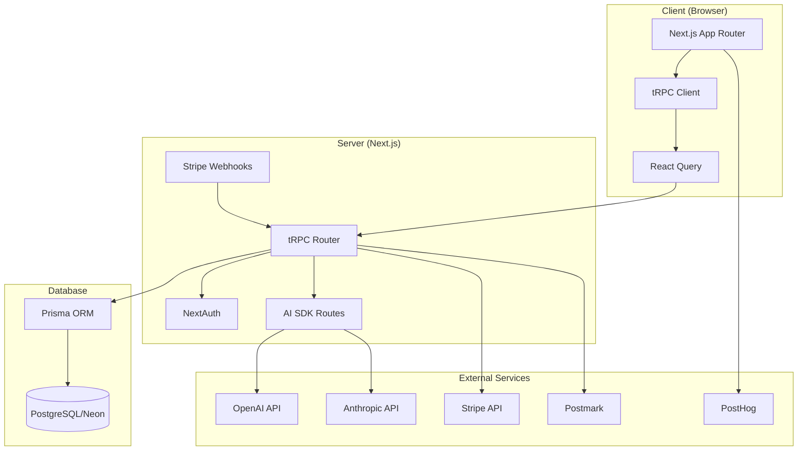
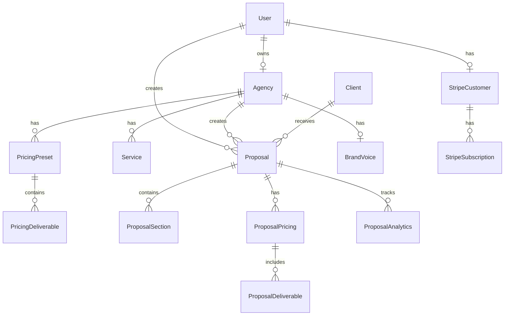
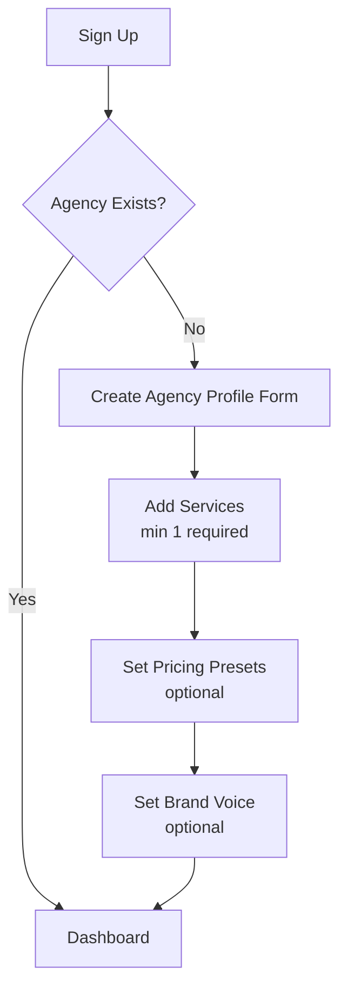
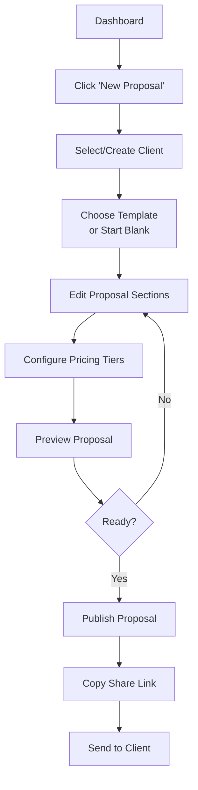
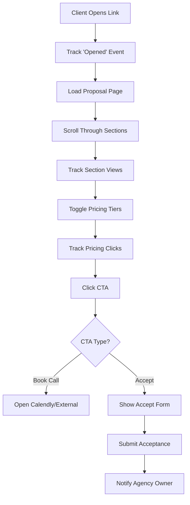
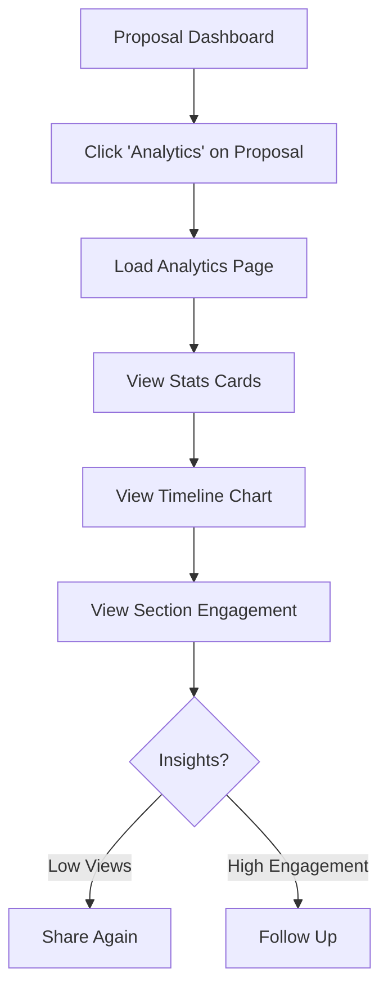

# SendVelo - Technical Architecture & Implementation Plan

## Table of Contents
1. [System Architecture](#system-architecture)
2. [Database Schema](#database-schema)
3. [Module Breakdown](#module-breakdown)
4. [User Screens & Flows](#user-screens--flows)
5. [tRPC API Design](#trpc-api-design)
6. [AI Integration Strategy](#ai-integration-strategy)
7. [Implementation Timeline](#implementation-timeline)

---

## System Architecture



### Technology Stack Layers

**Presentation Layer:**
- Next.js 14 App Router (RSC + Client Components)
- Shadcn/ui components
- Tailwind CSS
- React Hook Form + Zod

**API Layer:**
- tRPC v10 (type-safe API)
- Next.js API routes (for webhooks)
- Server Actions (for simple mutations)

**Business Logic:**
- tRPC procedures (routers)
- AI SDK streaming responses
- Stripe subscription management

**Data Layer:**
- Prisma ORM
- PostgreSQL (Neon serverless)
- Server-side caching (React Cache)

**External Integrations:**
- OpenAI/Anthropic (AI generation)
- Stripe (payments)
- Postmark (emails)
- PostHog (analytics)

---

## Database Schema

```prisma
// prisma/schema.prisma

generator client {
  provider = "prisma-client-js"
}

datasource db {
  provider = "postgresql"
  url      = env("DATABASE_URL")
}

// --- AUTHENTICATION & USERS ---

model Account {
  id                String  @id @default(cuid())
  userId            String
  type              String
  provider          String
  providerAccountId String
  refresh_token     String? @db.Text
  access_token      String? @db.Text
  expires_at        Int?
  token_type        String?
  scope             String?
  id_token          String? @db.Text
  session_state     String?

  user User @relation(fields: [userId], references: [id], onDelete: Cascade)

  @@unique([provider, providerAccountId])
  @@index([userId])
}

model Session {
  id           String   @id @default(cuid())
  sessionToken String   @unique
  userId       String
  expires      DateTime
  user         User     @relation(fields: [userId], references: [id], onDelete: Cascade)

  @@index([userId])
}

model User {
  id            String    @id @default(cuid())
  name          String?
  email         String?   @unique
  emailVerified DateTime?
  image         String?
  role          UserRole  @default(USER)
  createdAt     DateTime  @default(now())
  updatedAt     DateTime  @updatedAt

  accounts        Account[]
  sessions        Session[]
  agency          Agency?
  proposals       Proposal[]
  stripeCustomer  StripeCustomer?
}

enum UserRole {
  USER
  ADMIN
}

model VerificationToken {
  identifier String
  token      String   @unique
  expires    DateTime

  @@unique([identifier, token])
}

// --- AGENCY PROFILE ---

model Agency {
  id          String   @id @default(cuid())
  userId      String   @unique
  name        String
  website     String?
  logo        String?
  description String?  @db.Text
  createdAt   DateTime @default(now())
  updatedAt   DateTime @updatedAt

  user         User           @relation(fields: [userId], references: [id], onDelete: Cascade)
  services     Service[]
  pricingPresets PricingPreset[]
  brandVoice   BrandVoice?
  proposals    Proposal[]

  @@index([userId])
}

model Service {
  id          String  @id @default(cuid())
  agencyId    String
  name        String
  description String  @db.Text
  category    String?
  sortOrder   Int     @default(0)

  agency   Agency @relation(fields: [agencyId], references: [id], onDelete: Cascade)

  @@index([agencyId])
}

model BrandVoice {
  id        String  @id @default(cuid())
  agencyId  String  @unique
  tone      String? // "professional", "casual", "technical"
  style     String? @db.Text
  values    String? @db.Text
  examples  String? @db.Text

  agency Agency @relation(fields: [agencyId], references: [id], onDelete: Cascade)
}

model PricingPreset {
  id          String   @id @default(cuid())
  agencyId    String
  name        String   // "Basic", "Pro", "Enterprise"
  description String?  @db.Text
  basePrice   Decimal  @db.Decimal(10, 2)
  currency    String   @default("USD")
  sortOrder   Int      @default(0)
  createdAt   DateTime @default(now())

  agency        Agency              @relation(fields: [agencyId], references: [id], onDelete: Cascade)
  deliverables  PricingDeliverable[]

  @@index([agencyId])
}

model PricingDeliverable {
  id              String  @id @default(cuid())
  pricingPresetId String
  name            String
  description     String? @db.Text
  quantity        Int     @default(1)
  unit            String? // "posts", "hours", "campaigns"

  pricingPreset PricingPreset @relation(fields: [pricingPresetId], references: [id], onDelete: Cascade)

  @@index([pricingPresetId])
}

// --- CLIENT & PROPOSALS ---

model Client {
  id          String   @id @default(cuid())
  name        String
  email       String?
  website     String?
  industry    String?
  description String?  @db.Text
  createdAt   DateTime @default(now())

  proposals Proposal[]
}

model Proposal {
  id             String         @id @default(cuid())
  userId         String
  agencyId       String
  clientId       String
  slug           String         @unique
  title          String
  status         ProposalStatus @default(DRAFT)
  createdAt      DateTime       @default(now())
  updatedAt      DateTime       @updatedAt
  publishedAt    DateTime?
  expiresAt      DateTime?

  user     User     @relation(fields: [userId], references: [id], onDelete: Cascade)
  agency   Agency   @relation(fields: [agencyId], references: [id], onDelete: Cascade)
  client   Client   @relation(fields: [clientId], references: [id], onDelete: Cascade)
  sections ProposalSection[]
  pricing  ProposalPricing[]
  analytics ProposalAnalytics[]

  @@index([userId])
  @@index([agencyId])
  @@index([clientId])
  @@index([slug])
  @@index([status])
}

enum ProposalStatus {
  DRAFT
  PUBLISHED
  VIEWED
  ACCEPTED
  DECLINED
  EXPIRED
}

model ProposalSection {
  id         String  @id @default(cuid())
  proposalId String
  type       String  // "executive_summary", "audit", "strategy", "scope", "timeline"
  title      String
  content    String  @db.Text
  sortOrder  Int     @default(0)

  proposal Proposal @relation(fields: [proposalId], references: [id], onDelete: Cascade)

  @@index([proposalId])
  @@index([type])
}

model ProposalPricing {
  id          String  @id @default(cuid())
  proposalId  String
  tierName    String  // "Basic", "Pro", "Enterprise"
  price       Decimal @db.Decimal(10, 2)
  currency    String  @default("USD")
  description String? @db.Text
  sortOrder   Int     @default(0)
  isSelected  Boolean @default(false)

  proposal      Proposal                @relation(fields: [proposalId], references: [id], onDelete: Cascade)
  deliverables  ProposalDeliverable[]

  @@index([proposalId])
}

model ProposalDeliverable {
  id               String  @id @default(cuid())
  proposalPricingId String
  name             String
  description      String? @db.Text
  quantity         Int     @default(1)

  proposalPricing ProposalPricing @relation(fields: [proposalPricingId], references: [id], onDelete: Cascade)

  @@index([proposalPricingId])
}

// --- ANALYTICS ---

model ProposalAnalytics {
  id          String   @id @default(cuid())
  proposalId  String
  event       String   // "opened", "section_viewed", "pricing_clicked", "cta_clicked"
  metadata    Json?
  ipAddress   String?
  userAgent   String?
  timestamp   DateTime @default(now())

  proposal Proposal @relation(fields: [proposalId], references: [id], onDelete: Cascade)

  @@index([proposalId])
  @@index([event])
  @@index([timestamp])
}

// --- PAYMENTS (STRIPE) ---

model StripeCustomer {
  id               String   @id @default(cuid())
  userId           String   @unique
  stripeCustomerId String   @unique
  createdAt        DateTime @default(now())

  user          User                @relation(fields: [userId], references: [id], onDelete: Cascade)
  subscriptions StripeSubscription[]
}

model StripeSubscription {
  id                   String   @id @default(cuid())
  stripeCustomerId     String
  stripeSubscriptionId String   @unique
  stripePriceId        String
  status               String   // "active", "canceled", "past_due"
  currentPeriodStart   DateTime
  currentPeriodEnd     DateTime
  cancelAtPeriodEnd    Boolean  @default(false)
  createdAt            DateTime @default(now())
  updatedAt            DateTime @updatedAt

  stripeCustomer StripeCustomer @relation(fields: [stripeCustomerId], references: [id], onDelete: Cascade)

  @@index([stripeCustomerId])
  @@index([status])
}
```

### Database Relationships Diagram



---

## Module Breakdown

### 1. Authentication Module (`/auth`)

**Files:**
- `app/api/auth/[...nextauth]/route.ts` - NextAuth.js configuration
- `lib/auth/options.ts` - Auth options and callbacks
- `lib/auth/session.ts` - Server-side session helpers

**Features:**
- Email/password authentication
- OAuth providers (Google, GitHub)
- Protected routes middleware
- Role-based access control

**Components:**
- `components/auth/SignInForm.tsx`
- `components/auth/SignUpForm.tsx`
- `components/auth/UserMenu.tsx`

---

### 2. Agency Profile Module (`/agency`)

**tRPC Router:** `server/routers/agency.ts`

**Procedures:**
```typescript
agency.create()        // Create agency profile
agency.get()           // Get current agency
agency.update()        // Update agency info
agency.uploadLogo()    // Upload logo
```

**Database Tables:**
- `Agency`
- `Service`
- `BrandVoice`
- `PricingPreset`
- `PricingDeliverable`

**Pages:**
- `app/(dashboard)/agency/page.tsx` - Agency profile overview
- `app/(dashboard)/agency/settings/page.tsx` - Edit agency settings
- `app/(dashboard)/agency/services/page.tsx` - Manage services
- `app/(dashboard)/agency/pricing/page.tsx` - Configure pricing presets
- `app/(dashboard)/agency/branding/page.tsx` - Set brand voice

**Components:**
- `components/agency/AgencyProfileForm.tsx`
- `components/agency/ServiceList.tsx`
- `components/agency/ServiceForm.tsx`
- `components/agency/PricingTierBuilder.tsx`
- `components/agency/BrandVoiceEditor.tsx`

**Key Features:**
- Manual agency profile creation
- Service library management
- Pricing tier templates
- Brand voice configuration

---

### 3. Client Management Module (`/clients`)

**tRPC Router:** `server/routers/client.ts`

**Procedures:**
```typescript
client.create()        // Add new client
client.list()          // List all clients
client.get()           // Get client by ID
client.update()        // Update client info
client.delete()        // Remove client
```

**Database Tables:**
- `Client`

**Pages:**
- `app/(dashboard)/clients/page.tsx` - Client list
- `app/(dashboard)/clients/new/page.tsx` - Add client form

**Components:**
- `components/clients/ClientList.tsx`
- `components/clients/ClientForm.tsx`
- `components/clients/ClientCard.tsx`

**Key Features:**
- Manual client entry
- Client information storage
- Search and filter clients

---

### 4. Proposal Creation Module (`/proposals`)

**tRPC Router:** `server/routers/proposal.ts`

**Procedures:**
```typescript
proposal.create()           // Create draft proposal
proposal.list()             // List user proposals
proposal.get()              // Get proposal by ID/slug
proposal.update()           // Update proposal
proposal.updateSection()    // Edit specific section
proposal.delete()           // Delete proposal
proposal.publish()          // Publish proposal
proposal.duplicate()        // Clone proposal
```

**AI Routes (Streaming):**
- `app/api/ai/generate-summary/route.ts` - Executive summary
- `app/api/ai/generate-strategy/route.ts` - Strategy recommendations
- `app/api/ai/enhance-text/route.ts` - Text improvement

**Database Tables:**
- `Proposal`
- `ProposalSection`
- `ProposalPricing`
- `ProposalDeliverable`

**Pages:**
- `app/(dashboard)/proposals/page.tsx` - Proposal dashboard
- `app/(dashboard)/proposals/new/page.tsx` - Create new proposal
- `app/(dashboard)/proposals/[id]/edit/page.tsx` - Edit proposal

**Components:**
- `components/proposals/ProposalList.tsx`
- `components/proposals/ProposalCard.tsx`
- `components/proposals/ProposalEditor.tsx`
- `components/proposals/SectionEditor.tsx`
- `components/proposals/PricingEditor.tsx`
- `components/proposals/AIAssistantPanel.tsx`
- `components/proposals/TemplateSelector.tsx`

**Key Features (MVP v1):**
- Manual proposal creation
- Pre-built templates (3-5 sections)
- Text sections with rich editor
- Pricing tier configuration
- AI text enhancement (optional assist)
- Save as draft
- Publish to unique URL

---

### 5. Interactive Proposal Viewing (`/view`)

**Public Route:** `app/view/[slug]/page.tsx`

**tRPC Router:** `server/routers/proposalView.ts`

**Procedures:**
```typescript
proposalView.getBySlug()   // Get published proposal
proposalView.trackEvent()  // Track analytics event
```

**Database Tables:**
- `Proposal` (read-only)
- `ProposalAnalytics` (insert)

**Pages:**
- `app/view/[slug]/page.tsx` - Public proposal viewer

**Components:**
- `components/proposal-view/ProposalHeader.tsx`
- `components/proposal-view/ProposalSection.tsx`
- `components/proposal-view/PricingToggle.tsx`
- `components/proposal-view/CTAButton.tsx`
- `components/proposal-view/ProgressIndicator.tsx`

**Key Features:**
- Clean, modern proposal layout
- Pricing tier toggle (interactive)
- Mobile-responsive design
- No auth required
- Track scroll position
- Track section views
- Track pricing clicks
- Track CTA interactions
- Book-a-call button
- Social share meta tags

**Analytics Events:**
```typescript
{
  "proposal_opened": { timestamp, ipAddress, userAgent },
  "section_viewed": { section: "strategy", timeSpent: 45 },
  "pricing_toggled": { tier: "Pro", timestamp },
  "cta_clicked": { ctaType: "book_call", timestamp }
}
```

---

### 6. Analytics Dashboard (`/analytics`)

**tRPC Router:** `server/routers/analytics.ts`

**Procedures:**
```typescript
analytics.getProposalStats()     // Get stats for one proposal
analytics.getOverview()          // Get user overview stats
analytics.getEngagementTimeline()// Time-series data
```

**Database Tables:**
- `ProposalAnalytics` (read)

**Pages:**
- `app/(dashboard)/proposals/[id]/analytics/page.tsx` - Per-proposal analytics

**Components:**
- `components/analytics/ProposalStatsCard.tsx`
- `components/analytics/EngagementChart.tsx`
- `components/analytics/SectionHeatmap.tsx`
- `components/analytics/RecentActivity.tsx`

**Key Metrics (MVP v1):**
- Total views
- Unique visitors
- Average time on page
- Most viewed sections
- Pricing tier preferences
- CTA click rate
- Last viewed timestamp

**Features:**
- Real-time updates (via React Query polling)
- Email notifications on view (optional)
- Export analytics data (future)

---

### 7. Payments Module (`/billing`)

**tRPC Router:** `server/routers/billing.ts`

**Procedures:**
```typescript
billing.createCheckoutSession()  // Create Stripe checkout
billing.getSubscription()        // Get current subscription
billing.cancelSubscription()     // Cancel subscription
billing.updatePaymentMethod()    // Update card
```

**Stripe Webhooks:**
- `app/api/webhooks/stripe/route.ts`

**Webhook Events:**
- `checkout.session.completed`
- `invoice.payment_succeeded`
- `invoice.payment_failed`
- `customer.subscription.deleted`
- `customer.subscription.updated`

**Database Tables:**
- `StripeCustomer`
- `StripeSubscription`

**Pages:**
- `app/(dashboard)/billing/page.tsx` - Billing dashboard
- `app/(dashboard)/billing/plans/page.tsx` - Upgrade plans

**Components:**
- `components/billing/PricingPlans.tsx`
- `components/billing/SubscriptionCard.tsx`
- `components/billing/PaymentMethodForm.tsx`
- `components/billing/InvoiceHistory.tsx`

**Pricing Tiers (MVP):**
- **Free:** 5 proposals/month
- **Pro ($49/month):** Unlimited proposals + AI features
- **Team ($99/month):** Multiple users + advanced analytics

---

### 8. Email Notifications (`/emails`)

**Service:** `lib/email/postmark.ts`

**Templates (using React Email):**
```
emails/
  ├── proposal-viewed.tsx
  ├── welcome.tsx
  ├── payment-success.tsx
  └── payment-failed.tsx
```

**Email Triggers:**
- User signup → Welcome email
- Proposal viewed → Notification email
- Payment successful → Receipt email
- Payment failed → Retry email
- Subscription canceled → Confirmation email

**Implementation:**
```typescript
import { sendEmail } from '@/lib/email/postmark';

await sendEmail({
  to: user.email,
  templateAlias: 'proposal-viewed',
  templateModel: {
    proposalTitle: proposal.title,
    clientName: client.name,
    viewUrl: `${baseUrl}/proposals/${proposal.id}/analytics`
  }
});
```

---

## User Screens & Flows

### Flow 1: Onboarding (First-Time User)



**Screens:**
1. `app/onboarding/page.tsx` - Multi-step form
   - Step 1: Agency Info (name, website, logo)
   - Step 2: Services (add 1-5 services)
   - Step 3: Pricing (optional templates)
   - Step 4: Brand Voice (optional)

**Components:**
- `components/onboarding/OnboardingWizard.tsx`
- `components/onboarding/StepIndicator.tsx`
- `components/onboarding/AgencyInfoStep.tsx`
- `components/onboarding/ServicesStep.tsx`
- `components/onboarding/PricingStep.tsx`
- `components/onboarding/BrandVoiceStep.tsx`

---

### Flow 2: Create & Send Proposal



**Screens:**

**1. Dashboard** (`app/(dashboard)/page.tsx`)
- Recent proposals grid
- Quick stats (total proposals, views, pending)
- "Create New Proposal" CTA

**2. New Proposal Flow** (`app/(dashboard)/proposals/new/page.tsx`)
- Client selector dropdown (existing) or "Add New Client" inline form
- Template gallery (3-5 pre-built templates)
- Blank option

**3. Proposal Editor** (`app/(dashboard)/proposals/[id]/edit/page.tsx`)
- Left sidebar: Section navigation
- Main area: Rich text editor
- Right sidebar: AI Assistant (optional)
- Top bar: Save, Preview, Publish buttons

**Layout:**
```
┌─────────────────────────────────────────────────────────────┐
│  [SendVelo Logo]  Proposal: Client Name        [Save] [⚙]  │
├──────────┬──────────────────────────────────┬───────────────┤
│          │                                  │               │
│ Sections │         Editor Area              │  AI Assistant │
│          │                                  │               │
│ □ Summary│  [Rich Text Editor]              │  💡 Enhance   │
│ ✓ Audit  │                                  │     Text      │
│ □ Strategy                                  │               │
│ □ Scope  │  Lorem ipsum dolor sit amet...   │  ✨ Generate  │
│ □ Timeline                                  │     Strategy  │
│ □ Pricing│                                  │               │
│          │                                  │  📝 Rewrite   │
│ [+ Add]  │                                  │               │
│          │                                  │               │
└──────────┴──────────────────────────────────┴───────────────┘
```

**4. Pricing Editor** (`app/(dashboard)/proposals/[id]/pricing/page.tsx`)
- 3-tier pricing table builder
- Add/remove deliverables per tier
- Set prices manually
- Preview pricing display

**5. Preview Modal**
- Full-screen preview of public proposal view
- "This is how your client will see it"
- Toggle between pricing tiers
- Close → Back to editor

**6. Published State**
- Success message with shareable URL
- Copy link button
- "View Analytics" link
- "Edit Proposal" button

---

### Flow 3: Client Views Proposal



**Public Proposal View** (`app/view/[slug]/page.tsx`)

**Layout:**
```
┌─────────────────────────────────────────────────────────────┐
│                    [Agency Logo]                            │
│              Proposal for [Client Name]                     │
└─────────────────────────────────────────────────────────────┘

┌─────────────────────────────────────────────────────────────┐
│  📄 Executive Summary                                       │
│                                                             │
│  Lorem ipsum dolor sit amet, consectetur adipiscing elit... │
└─────────────────────────────────────────────────────────────┘

┌─────────────────────────────────────────────────────────────┐
│  🔍 Audit & Analysis                                        │
│                                                             │
│  Current state analysis content...                         │
└─────────────────────────────────────────────────────────────┘

┌─────────────────────────────────────────────────────────────┐
│  📊 Pricing Options                                         │
│                                                             │
│  [Basic] [Pro ✓] [Enterprise]     ← Interactive Tabs       │
│                                                             │
│  $2,500/month                                               │
│  ✓ Deliverable 1                                            │
│  ✓ Deliverable 2                                            │
│  ✓ Deliverable 3                                            │
└─────────────────────────────────────────────────────────────┘

┌─────────────────────────────────────────────────────────────┐
│          [📞 Book a Call]  [✅ Accept Proposal]             │
└─────────────────────────────────────────────────────────────┘
```

**Features:**
- Sticky header with agency branding
- Smooth scroll animations
- Pricing tier tabs (client-side state)
- CTA buttons always visible (sticky footer on mobile)
- Print-friendly CSS
- OG image preview for social sharing

---

### Flow 4: View Analytics



**Analytics Page** (`app/(dashboard)/proposals/[id]/analytics/page.tsx`)

**Layout:**
```
┌─────────────────────────────────────────────────────────────┐
│  Analytics: [Proposal Title]                    [Export]   │
├─────────────────────────────────────────────────────────────┤
│                                                             │
│  📊 Total Views    ⏱️ Avg. Time      👁️ Last Viewed       │
│       12               3m 42s          2 hours ago         │
│                                                             │
├─────────────────────────────────────────────────────────────┤
│  Views Over Time                                            │
│                                                             │
│  [Line Chart: Daily Views]                                 │
│                                                             │
├─────────────────────────────────────────────────────────────┤
│  Section Engagement                                         │
│                                                             │
│  Executive Summary  ████████████ 85%                        │
│  Audit & Analysis   ██████░░░░░░ 62%                        │
│  Strategy          ████████░░░░ 71%                        │
│  Pricing           ███████████░ 93%                        │
│                                                             │
├─────────────────────────────────────────────────────────────┤
│  Pricing Tier Interest                                      │
│                                                             │
│  Basic: 2 clicks    Pro: 8 clicks    Enterprise: 3 clicks  │
│                                                             │
└─────────────────────────────────────────────────────────────┘
```

**Components:**
- `components/analytics/StatsCards.tsx`
- `components/analytics/ViewsChart.tsx` (using Recharts)
- `components/analytics/SectionEngagement.tsx`
- `components/analytics/PricingHeatmap.tsx`
- `components/analytics/ActivityFeed.tsx`

---

## tRPC API Design

### Router Structure

```
server/
├── routers/
│   ├── agency.ts          # Agency CRUD + services
│   ├── client.ts          # Client management
│   ├── proposal.ts        # Proposal CRUD + publish
│   ├── proposalView.ts    # Public proposal fetch + analytics
│   ├── analytics.ts       # Analytics aggregation
│   └── billing.ts         # Stripe operations
├── trpc.ts               # tRPC instance + context
└── index.ts              # Root router
```

### Example Router: `proposal.ts`

```typescript
import { z } from 'zod';
import { router, protectedProcedure } from '../trpc';
import { TRPCError } from '@trpc/server';

export const proposalRouter = router({
  // Create new proposal
  create: protectedProcedure
    .input(
      z.object({
        clientId: z.string().cuid(),
        title: z.string().min(1).max(200),
        templateId: z.string().optional(),
      })
    )
    .mutation(async ({ ctx, input }) => {
      const agency = await ctx.prisma.agency.findUnique({
        where: { userId: ctx.session.user.id },
      });

      if (!agency) {
        throw new TRPCError({
          code: 'NOT_FOUND',
          message: 'Agency profile not found',
        });
      }

      const proposal = await ctx.prisma.proposal.create({
        data: {
          userId: ctx.session.user.id,
          agencyId: agency.id,
          clientId: input.clientId,
          title: input.title,
          slug: generateSlug(),
          status: 'DRAFT',
        },
      });

      // If template selected, copy sections
      if (input.templateId) {
        // ... copy template sections logic
      }

      return proposal;
    }),

  // List user proposals
  list: protectedProcedure
    .input(
      z.object({
        status: z.enum(['DRAFT', 'PUBLISHED', 'VIEWED', 'ACCEPTED']).optional(),
        limit: z.number().min(1).max(100).default(20),
        cursor: z.string().cuid().optional(),
      })
    )
    .query(async ({ ctx, input }) => {
      const proposals = await ctx.prisma.proposal.findMany({
        where: {
          userId: ctx.session.user.id,
          status: input.status,
        },
        include: {
          client: true,
          _count: {
            select: { analytics: true },
          },
        },
        take: input.limit + 1,
        cursor: input.cursor ? { id: input.cursor } : undefined,
        orderBy: { createdAt: 'desc' },
      });

      let nextCursor: typeof input.cursor | undefined = undefined;
      if (proposals.length > input.limit) {
        const nextItem = proposals.pop();
        nextCursor = nextItem!.id;
      }

      return {
        proposals,
        nextCursor,
      };
    }),

  // Get single proposal
  get: protectedProcedure
    .input(z.object({ id: z.string().cuid() }))
    .query(async ({ ctx, input }) => {
      const proposal = await ctx.prisma.proposal.findFirst({
        where: {
          id: input.id,
          userId: ctx.session.user.id,
        },
        include: {
          client: true,
          agency: true,
          sections: {
            orderBy: { sortOrder: 'asc' },
          },
          pricing: {
            include: { deliverables: true },
            orderBy: { sortOrder: 'asc' },
          },
        },
      });

      if (!proposal) {
        throw new TRPCError({
          code: 'NOT_FOUND',
          message: 'Proposal not found',
        });
      }

      return proposal;
    }),

  // Update proposal
  update: protectedProcedure
    .input(
      z.object({
        id: z.string().cuid(),
        title: z.string().optional(),
        expiresAt: z.date().optional(),
      })
    )
    .mutation(async ({ ctx, input }) => {
      const { id, ...data } = input;

      return ctx.prisma.proposal.update({
        where: { id },
        data,
      });
    }),

  // Update section content
  updateSection: protectedProcedure
    .input(
      z.object({
        sectionId: z.string().cuid(),
        title: z.string().optional(),
        content: z.string(),
      })
    )
    .mutation(async ({ ctx, input }) => {
      const { sectionId, ...data } = input;

      return ctx.prisma.proposalSection.update({
        where: { id: sectionId },
        data,
      });
    }),

  // Publish proposal
  publish: protectedProcedure
    .input(z.object({ id: z.string().cuid() }))
    .mutation(async ({ ctx, input }) => {
      return ctx.prisma.proposal.update({
        where: { id: input.id },
        data: {
          status: 'PUBLISHED',
          publishedAt: new Date(),
        },
      });
    }),

  // Delete proposal
  delete: protectedProcedure
    .input(z.object({ id: z.string().cuid() }))
    .mutation(async ({ ctx, input }) => {
      return ctx.prisma.proposal.delete({
        where: { id: input.id },
      });
    }),
});
```

### Example Router: `proposalView.ts` (Public)

```typescript
import { z } from 'zod';
import { router, publicProcedure } from '../trpc';
import { TRPCError } from '@trpc/server';

export const proposalViewRouter = router({
  // Get proposal by slug (public)
  getBySlug: publicProcedure
    .input(z.object({ slug: z.string() }))
    .query(async ({ ctx, input }) => {
      const proposal = await ctx.prisma.proposal.findUnique({
        where: {
          slug: input.slug,
          status: 'PUBLISHED',
        },
        include: {
          agency: {
            include: {
              services: true,
            },
          },
          client: true,
          sections: {
            orderBy: { sortOrder: 'asc' },
          },
          pricing: {
            include: { deliverables: true },
            orderBy: { sortOrder: 'asc' },
          },
        },
      });

      if (!proposal) {
        throw new TRPCError({
          code: 'NOT_FOUND',
          message: 'Proposal not found',
        });
      }

      return proposal;
    }),

  // Track analytics event (public)
  trackEvent: publicProcedure
    .input(
      z.object({
        proposalId: z.string().cuid(),
        event: z.enum(['opened', 'section_viewed', 'pricing_clicked', 'cta_clicked']),
        metadata: z.record(z.any()).optional(),
      })
    )
    .mutation(async ({ ctx, input }) => {
      // Get IP and user agent from request headers
      const ipAddress = ctx.req.headers.get('x-forwarded-for') ||
                        ctx.req.headers.get('x-real-ip') ||
                        'unknown';
      const userAgent = ctx.req.headers.get('user-agent') || 'unknown';

      await ctx.prisma.proposalAnalytics.create({
        data: {
          proposalId: input.proposalId,
          event: input.event,
          metadata: input.metadata,
          ipAddress,
          userAgent,
        },
      });

      // If first "opened" event, update proposal status
      if (input.event === 'opened') {
        await ctx.prisma.proposal.updateMany({
          where: {
            id: input.proposalId,
            status: 'PUBLISHED',
          },
          data: {
            status: 'VIEWED',
          },
        });
      }

      return { success: true };
    }),
});
```

---

## AI Integration Strategy

### AI Features (MVP v1 - Optional Enhancements)

1. **Text Enhancement** - Improve existing user-written text
2. **Section Generation** - Generate content for specific sections
3. **Tone Adjustment** - Rewrite in different tones

**NOT in MVP v1:**
- Auto-audit (website scraping)
- Full proposal generation
- Client research

### Implementation: Vercel AI SDK

**Route:** `app/api/ai/enhance-text/route.ts`

```typescript
import { openai } from '@ai-sdk/openai';
import { streamText } from 'ai';
import { auth } from '@/lib/auth/session';

export const runtime = 'edge';

export async function POST(req: Request) {
  const session = await auth();
  if (!session?.user) {
    return new Response('Unauthorized', { status: 401 });
  }

  const { text, instruction } = await req.json();

  const result = streamText({
    model: openai('gpt-4o-mini'),
    system: 'You are a professional marketing proposal writer. Enhance the provided text while maintaining the core message.',
    prompt: `Instruction: ${instruction}\n\nText to enhance:\n${text}`,
    maxTokens: 1000,
  });

  return result.toTextStreamResponse();
}
```

**Client Component:** `components/proposals/AIAssistantPanel.tsx`

```typescript
'use client';

import { useCompletion } from 'ai/react';
import { Button } from '@/components/ui/button';
import { Textarea } from '@/components/ui/textarea';

export function AIAssistantPanel({
  selectedText,
  onTextReplacement
}: {
  selectedText: string;
  onTextReplacement: (text: string) => void;
}) {
  const { completion, complete, isLoading } = useCompletion({
    api: '/api/ai/enhance-text',
  });

  const handleEnhance = async () => {
    await complete(selectedText, {
      body: {
        text: selectedText,
        instruction: 'Make this more professional and compelling',
      },
    });
  };

  return (
    <div className="space-y-4">
      <h3 className="font-semibold">AI Assistant</h3>

      <Button
        onClick={handleEnhance}
        disabled={!selectedText || isLoading}
      >
        ✨ Enhance Text
      </Button>

      {completion && (
        <div className="border rounded-lg p-4 space-y-2">
          <p className="text-sm text-muted-foreground">AI Suggestion:</p>
          <Textarea value={completion} readOnly rows={6} />
          <Button onClick={() => onTextReplacement(completion)}>
            Use This Text
          </Button>
        </div>
      )}
    </div>
  );
}
```

### AI Prompts Library

**File:** `lib/ai/prompts.ts`

```typescript
export const prompts = {
  enhanceText: (text: string, tone: string) => `
    Rewrite the following text in a ${tone} tone while maintaining the core message.
    Make it compelling for a business proposal.

    Original text:
    ${text}
  `,

  generateExecutiveSummary: (clientInfo: string, services: string[]) => `
    Write a professional executive summary for a marketing proposal.

    Client: ${clientInfo}
    Services offered: ${services.join(', ')}

    Keep it concise (2-3 paragraphs), focus on value and ROI.
  `,

  generateStrategy: (industry: string, goals: string) => `
    Create a strategic approach section for a marketing proposal.

    Industry: ${industry}
    Goals: ${goals}

    Include 3-4 key strategic pillars with brief explanations.
  `,
};
```

---

## Implementation Timeline

### Week 1: Foundation & Setup

**Day 1-2: Project Setup**
- [ ] Initialize with Create T3 App
  ```bash
  pnpm create t3-app@latest sendvelo
  # Select: TypeScript, tRPC, Prisma, NextAuth, Tailwind
  ```
- [ ] Install shadcn/ui
  ```bash
  pnpm dlx shadcn@latest init
  pnpm dlx shadcn@latest add button input form label textarea select
  pnpm dlx shadcn@latest add card dialog dropdown-menu toast tabs
  ```
- [ ] Install additional dependencies
  ```bash
  pnpm add stripe @stripe/stripe-js @stripe/react-stripe-js
  pnpm add postmark react-email
  pnpm add ai @ai-sdk/openai
  pnpm add posthog-js posthog-node
  pnpm add date-fns sonner
  ```
- [ ] Set up environment variables (.env)
- [ ] Configure Prisma schema (copy from above)
- [ ] Run first migration
  ```bash
  pnpm prisma migrate dev --name init
  ```

**Day 3-4: Authentication & Agency Module**
- [ ] Configure NextAuth with email/password
- [ ] Create auth pages (sign in, sign up)
- [ ] Build agency profile creation flow
- [ ] Create agency settings page
- [ ] Build service management UI
- [ ] Create pricing preset builder
- [ ] Implement tRPC router: `agency.ts`

**Day 5: Client Management**
- [ ] Create client CRUD operations
- [ ] Build client list page
- [ ] Build client form component
- [ ] Implement tRPC router: `client.ts`

---

### Week 2: Proposal Creation & Viewing

**Day 1-2: Proposal Editor**
- [ ] Create proposal creation flow
- [ ] Build template selector
- [ ] Implement rich text editor (Tiptap or Lexical)
- [ ] Build section management (add/edit/delete/reorder)
- [ ] Create pricing tier editor
- [ ] Implement save draft functionality
- [ ] Create tRPC router: `proposal.ts`

**Day 3: AI Integration (Optional)**
- [ ] Set up AI SDK routes
- [ ] Build AI assistant panel component
- [ ] Implement text enhancement
- [ ] Add tone adjustment
- [ ] Create prompts library

**Day 4-5: Public Proposal View**
- [ ] Build public proposal viewer page
- [ ] Implement responsive layout
- [ ] Create pricing toggle component
- [ ] Add CTA buttons
- [ ] Implement analytics tracking
- [ ] Create tRPC router: `proposalView.ts`
- [ ] Test on mobile devices

---

### Week 3: Analytics, Payments & Polish

**Day 1: Analytics Dashboard**
- [ ] Create analytics aggregation queries
- [ ] Build stats cards component
- [ ] Integrate Recharts for visualizations
- [ ] Create engagement heatmap
- [ ] Implement tRPC router: `analytics.ts`

**Day 2: Stripe Integration**
- [ ] Create Stripe products and prices
- [ ] Implement checkout session creation
- [ ] Build webhook handler
- [ ] Create billing dashboard page
- [ ] Build subscription management UI
- [ ] Implement tRPC router: `billing.ts`

**Day 3: Email Notifications**
- [ ] Set up Postmark account
- [ ] Create React Email templates
- [ ] Implement email service wrapper
- [ ] Add email triggers (proposal viewed, payment events)
- [ ] Test all email flows

**Day 4: PostHog Analytics**
- [ ] Set up PostHog project
- [ ] Add PostHog provider to app
- [ ] Implement key event tracking
  - User signup
  - Proposal created
  - Proposal published
  - Proposal viewed
  - Subscription started
- [ ] Create funnels and insights

**Day 5: Testing & Deployment**
- [ ] Write critical tests (Vitest)
- [ ] Test all user flows end-to-end
- [ ] Fix bugs and polish UI
- [ ] Optimize performance
- [ ] Deploy to Vercel
- [ ] Set up production database (Neon)
- [ ] Configure environment variables
- [ ] Test production deployment

---

## Post-MVP Roadmap (Week 4+)

### Phase 2 Features (Weeks 4-6)
1. **AI Auto-Audit** - Website scraping and analysis
2. **Full Proposal Generation** - AI-generated proposals from client URL
3. **Email Integration** - Send proposals via email
4. **Team Collaboration** - Multiple users per agency
5. **Proposal Templates Gallery** - More pre-built templates
6. **PDF Export** - Download proposals as PDF
7. **E-signature** - Digital proposal signing

### Phase 3 Features (Weeks 7-12)
1. **CRM Integration** - HubSpot, Pipedrive connections
2. **Calendar Integration** - Embedded booking
3. **Payment Collection** - Accept deposits via Stripe
4. **Contract Management** - Proposal → Contract workflow
5. **Advanced Analytics** - Conversion funnels, A/B testing
6. **Mobile App** - React Native companion
7. **White Label** - Agency branding options

---

## Directory Structure

```
sendvelo/
├── app/
│   ├── (auth)/
│   │   ├── signin/
│   │   │   └── page.tsx
│   │   └── signup/
│   │       └── page.tsx
│   ├── (dashboard)/
│   │   ├── layout.tsx
│   │   ├── page.tsx                      # Dashboard home
│   │   ├── agency/
│   │   │   ├── page.tsx                  # Agency profile
│   │   │   ├── settings/
│   │   │   ├── services/
│   │   │   ├── pricing/
│   │   │   └── branding/
│   │   ├── clients/
│   │   │   ├── page.tsx                  # Client list
│   │   │   └── new/
│   │   │       └── page.tsx              # Add client
│   │   ├── proposals/
│   │   │   ├── page.tsx                  # Proposal list
│   │   │   ├── new/
│   │   │   │   └── page.tsx              # Create proposal
│   │   │   └── [id]/
│   │   │       ├── edit/
│   │   │       │   └── page.tsx          # Edit proposal
│   │   │       └── analytics/
│   │   │           └── page.tsx          # Proposal analytics
│   │   └── billing/
│   │       ├── page.tsx                  # Billing dashboard
│   │       └── plans/
│   │           └── page.tsx              # Pricing plans
│   ├── view/
│   │   └── [slug]/
│   │       └── page.tsx                  # Public proposal view
│   ├── onboarding/
│   │   └── page.tsx                      # First-time setup wizard
│   ├── api/
│   │   ├── auth/
│   │   │   └── [...nextauth]/
│   │   │       └── route.ts
│   │   ├── trpc/
│   │   │   └── [trpc]/
│   │   │       └── route.ts
│   │   ├── webhooks/
│   │   │   └── stripe/
│   │   │       └── route.ts
│   │   └── ai/
│   │       ├── enhance-text/
│   │       │   └── route.ts
│   │       ├── generate-summary/
│   │       │   └── route.ts
│   │       └── generate-strategy/
│   │           └── route.ts
│   ├── globals.css
│   └── layout.tsx
├── components/
│   ├── ui/                               # shadcn/ui components
│   ├── auth/
│   │   ├── SignInForm.tsx
│   │   ├── SignUpForm.tsx
│   │   └── UserMenu.tsx
│   ├── agency/
│   │   ├── AgencyProfileForm.tsx
│   │   ├── ServiceList.tsx
│   │   ├── PricingTierBuilder.tsx
│   │   └── BrandVoiceEditor.tsx
│   ├── clients/
│   │   ├── ClientList.tsx
│   │   ├── ClientForm.tsx
│   │   └── ClientCard.tsx
│   ├── proposals/
│   │   ├── ProposalList.tsx
│   │   ├── ProposalCard.tsx
│   │   ├── ProposalEditor.tsx
│   │   ├── SectionEditor.tsx
│   │   ├── PricingEditor.tsx
│   │   ├── AIAssistantPanel.tsx
│   │   └── TemplateSelector.tsx
│   ├── proposal-view/
│   │   ├── ProposalHeader.tsx
│   │   ├── ProposalSection.tsx
│   │   ├── PricingToggle.tsx
│   │   └── CTAButton.tsx
│   ├── analytics/
│   │   ├── StatsCards.tsx
│   │   ├── ViewsChart.tsx
│   │   ├── SectionEngagement.tsx
│   │   └── ActivityFeed.tsx
│   ├── billing/
│   │   ├── PricingPlans.tsx
│   │   ├── SubscriptionCard.tsx
│   │   └── PaymentMethodForm.tsx
│   └── layout/
│       ├── Navbar.tsx
│       ├── Sidebar.tsx
│       └── Footer.tsx
├── server/
│   ├── routers/
│   │   ├── agency.ts
│   │   ├── client.ts
│   │   ├── proposal.ts
│   │   ├── proposalView.ts
│   │   ├── analytics.ts
│   │   └── billing.ts
│   ├── trpc.ts
│   └── index.ts
├── lib/
│   ├── auth/
│   │   ├── options.ts
│   │   └── session.ts
│   ├── email/
│   │   ├── postmark.ts
│   │   └── templates/
│   ├── ai/
│   │   ├── prompts.ts
│   │   └── helpers.ts
│   ├── stripe/
│   │   ├── client.ts
│   │   └── webhooks.ts
│   ├── analytics/
│   │   └── posthog.ts
│   ├── utils.ts
│   └── prisma.ts
├── emails/                               # React Email templates
│   ├── proposal-viewed.tsx
│   ├── welcome.tsx
│   └── payment-success.tsx
├── prisma/
│   ├── schema.prisma
│   └── migrations/
├── public/
├── env.ts                                # T3 Env validation
├── tailwind.config.ts
├── components.json                       # shadcn/ui config
├── tsconfig.json
├── next.config.mjs
├── package.json
└── .env.example
```

---

## Key Technical Decisions

### 1. **tRPC over REST/GraphQL**
- End-to-end type safety
- No code generation needed
- Excellent DX with React Query
- Matches Digitaliko standards

### 2. **Prisma over Drizzle**
- Better documentation
- Easier migrations
- Team familiarity
- Matches existing projects

### 3. **NextAuth v5 over Clerk/Auth0**
- Open source
- Full control
- No per-user pricing
- Integrates with Prisma

### 4. **Vercel AI SDK over LangChain**
- Simpler API
- Built for streaming
- React hooks included
- Lighter weight

### 5. **Server Components + Client Components**
- Use Server Components by default
- Client Components only when needed:
  - Forms with React Hook Form
  - Interactive elements (pricing toggle)
  - AI streaming responses
  - Real-time analytics

### 6. **PostgreSQL (Neon) over MongoDB**
- Relational data (agencies → proposals → sections)
- Prisma best support
- ACID transactions
- Better for business logic

### 7. **Postmark over SendGrid/Mailgun**
- Higher deliverability
- Better developer experience
- Template management
- Used in other Digitaliko projects

---

## Environment Variables

```bash
# .env.example

# Database
DATABASE_URL="postgresql://..."

# NextAuth
NEXTAUTH_SECRET=""
NEXTAUTH_URL="http://localhost:3000"

# OAuth Providers (optional)
GOOGLE_CLIENT_ID=""
GOOGLE_CLIENT_SECRET=""
GITHUB_ID=""
GITHUB_SECRET=""

# AI
OPENAI_API_KEY=""
ANTHROPIC_API_KEY=""

# Stripe
STRIPE_SECRET_KEY=""
STRIPE_PUBLISHABLE_KEY=""
STRIPE_WEBHOOK_SECRET=""
STRIPE_PRICE_ID_PRO=""
STRIPE_PRICE_ID_TEAM=""

# Email
POSTMARK_API_TOKEN=""
POSTMARK_FROM_EMAIL="noreply@sendvelo.com"

# Analytics
NEXT_PUBLIC_POSTHOG_KEY=""
NEXT_PUBLIC_POSTHOG_HOST="https://app.posthog.com"

# App
NEXT_PUBLIC_APP_URL="http://localhost:3000"
```

---

## Summary

This architecture provides:

✅ **Type Safety**: tRPC + Prisma + Zod across entire stack
✅ **Scalability**: Modular routers, serverless database
✅ **Developer Experience**: Hot reload, type inference, auto-completion
✅ **Maintainability**: Clear separation of concerns, consistent patterns
✅ **Performance**: Edge functions, streaming AI, optimistic updates
✅ **Digitaliko Alignment**: Matches stack from slovenskaznamka & offroadmarket

**Next Steps:**
1. Review and approve this architecture
2. Start Week 1 implementation
3. Set up project repository
4. Begin with T3 App initialization

Ready to implement! 🚀
